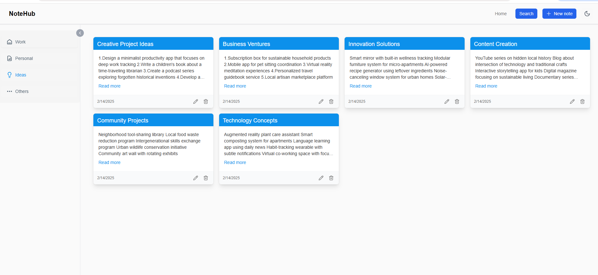
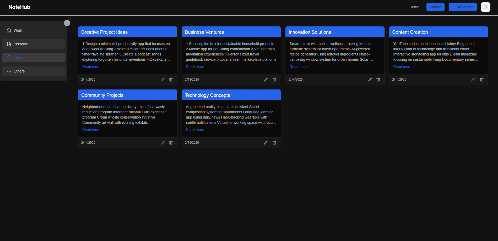
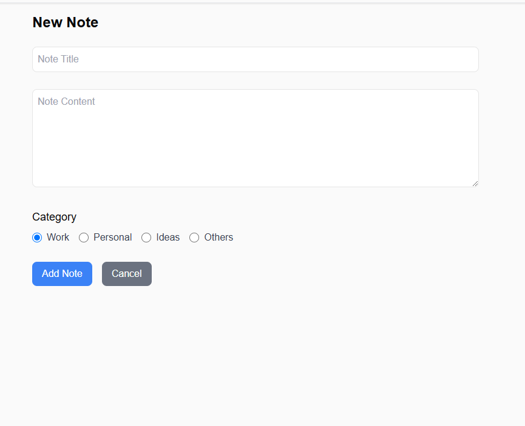
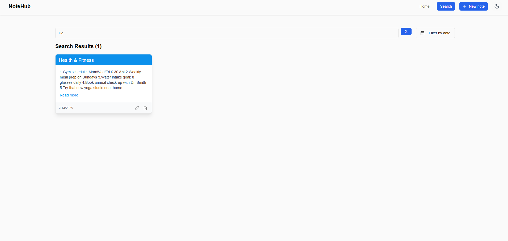
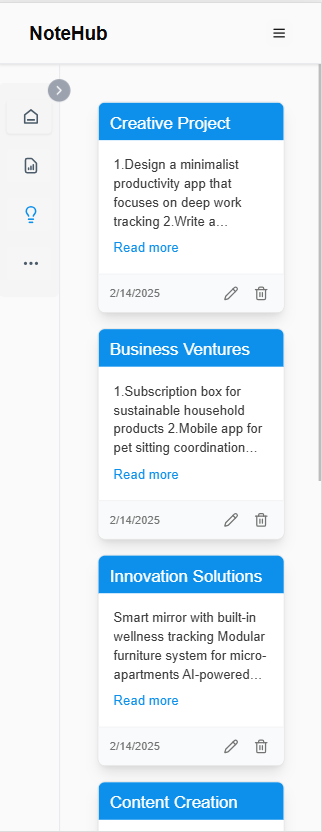

# NoteHub 📝
A React-based notes management application that helps you organize your thoughts, ideas, and tasks efficiently , using Vite as the build tool.

## Overview
NoteHub is a user-friendly note-taking application that allows you to create, manage, and organize your notes with ease. Whether you're jotting down work-related tasks, personal reminders, or creative ideas, NoteHub provides a seamless experience for all your note-taking needs.

### Key Features
- **Note Management**: Create, edit, and delete notes with a clean, intuitive interface
- **Smart Categorization**: Organize notes into different categories:
  - Work
  - Personal
  - Ideas
  - Others
- **Quick Search**: Easily find your notes using the search functionality
- **User-Friendly Interface**: Modern and responsive design for optimal user experience

## Technologies & Libraries Used 🛠️
### Core Technologies
- React 18
- TypeScript
- Tailwind CSS

### State Management & Routing
- Zustand - For state management
- React Router DOM - For navigation and routing

### UI & Forms
- Shadcn - UI component library
- Formik - Form handling and validation

### Storage
- Local Storage - For persistent data storage

### Development Tools
- Vite - Build tool and development server
- Vitest - Build tool and development server
- ESLint - Code linting
- Prettier - Code formatting

## Installation & Setup 🚀

### Prerequisites
- Node.js (v20.13.1)
- npm (comes with Node.js)

### Getting Started

1. Clone the repository
```bash
git clone https://github.com/yourusername/notesManager.git
cd notesManager

1. Install dependencies:
```npm install```

2. Start the development server:
```npm run dev```

The app will be available at `http://localhost:5173`

## Available Scripts

The project includes the following npm scripts:

- **`npm run dev`** - Starts the development server using Vite.
- **`npm test`** - Start testing.
- **`npm run build`** - Compiles TypeScript and builds the project for production.
- **`npm run lint`** - Runs ESLint to check for code issues.
- **`npm run format`** - Formats the code using Prettier.
- **`npm run format:check`** - Checks if the code follows the Prettier formatting rules.
- **`npm run preview`** - Serves the production build locally for testing.

## Testing
- Tool: Vitest with React Testing Library
- Setup : ```npm install -D vitest @testing-library/react @testing-library/jest-dom jsdom```
- Configure: Add test settings in vite.configure.ts
- Test Files: Create .test.tsx files alongside components
- Run Tests: All Tests : ```npm test```

## Project Structure 📁

- notesManager/
  - src/
    - components/      # Reusable components
      - Header/       
      - Sidebar/      
      - ui/          
        - button.tsx
    - context/        # React context files
    - features/       # Feature-specific components
    - pages/          # Page components
    - store/          # State management (Zustand)
    - types/          # TypeScript type definitions
    - assets/         # Static assets and images
    - App.css
    - App.tsx         # Main App component
    - index.css
    - main.tsx        # Entry point
  - public/          
  - .gitignore
  - .prettierrc
  - components.json
  - eslint.config.js
  - postcss.config.js
  - tailwind.config.js
  - tsconfig.json
  - package.json
  
## Screenshots

### Home Page



### Add Notes


### Search Notes


### Mobile Screen

